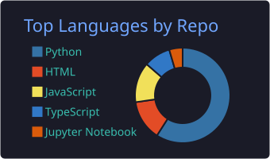
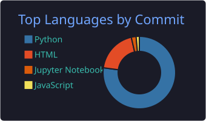
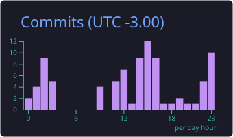

## Hi, I'm Lucca! 👋
### 📊 Data Analyst | 🧮 SQL · Python · BI | ☁️ Modern Data Stack

Data Analyst turning raw data into business decisions. SQL · Python · Power BI · BigQuery. I build dashboards, ETL pipelines, and analytics that ship — with a strong interest in experimentation, A/B testing, and analytics engineering on the modern data stack.

---

### 🧰 Languages & Querying

  
  
  
  
  
  

### 📊 BI & Visualization

  
  
  
  

### 🗄️ Data Warehouses & Databases

  
  
  
  
  

### 🔧 ETL & Analytics Engineering

  
  
  
  
  
  

### 🛠️ Tools & Platforms

  
  
  
  
  
  

---

### 💡 What I Work With

* 📈 **Analytics & Experimentation:** A/B testing, hypothesis testing, cohort & funnel analysis, KPI design.
* 🧱 **Modern Data Stack:** dbt models, data marts, semantic layers, data quality testing.
* 📊 **Dashboards & Reporting:** Executive reporting, product analytics, marketing attribution, financial KPIs.
* 🐍 **Python for Analytics:** pandas, NumPy, matplotlib, seaborn, scikit-learn for predictive modeling.
* 🧮 **Statistics:** Regression, segmentation, time-series, confidence intervals, lift calculation.
* 🗣️ **Data Storytelling:** Translating findings into clear narratives for non-technical stakeholders.

---

### 📊 GitHub Stats

  

  
  

  

  

  

  
  

  
  

---

### 🌟 Featured Projects

Each project ships with a **live walkthrough** (futurist dark page, hosted on GitHub Pages) and a full repo with code, business memo, and reproducibility instructions.

* **[dbt Analytics Warehouse](https://github.com/Ucazin/dbt-analytics-warehouse)** · [🌐 walkthrough](https://ucazin.github.io/dbt-analytics-warehouse/) — Production-shaped dbt project on DuckDB. **5 sources → 5 staging → 3 intermediate → 6 marts → 1 snapshot, 70 tests, 2 exposures.** Portable to Snowflake/BigQuery with a profile change. `dbt · DuckDB · SQL · Python`

* **[A/B Testing Framework](https://github.com/Ucazin/ab-testing-framework)** · [🌐 walkthrough](https://ucazin.github.io/ab-testing-framework/) — End-to-end experimentation toolkit on a 60k-user synthetic experiment: **power analysis, SRM (chi²), CUPED, Benjamini-Hochberg**, auto-generated decision doc. **Headline:** CVR +9.4% (p=0.0068), revenue +$0.225/visitor (p=0.0097), 0/8 segments significant after BH → ~$984k annualized uplift. `Python · statsmodels · scipy`

* **[SaaS MRR, Churn & Cohort Analytics](https://github.com/Ucazin/saas-mrr-churn-analytics)** · [🌐 walkthrough](https://ucazin.github.io/saas-mrr-churn-analytics/) — Subscription analytics on a synthetic SaaS dataset (5,000 customers · 36 months · 3 tiers). MRR waterfall, NRR/GRR cohorts, Kaplan-Meier survival, LTV/CAC. **Headline:** ending MRR **$1.99M**, median **NRR 85.2%**, 12-month survival **53.9%**, **LTV/CAC up to 17.0×**. Churn concentrates in months 3–6. `Python · pandas · matplotlib`

* **[Olist E-commerce SQL Analytics](https://github.com/Ucazin/olist-ecommerce-analytics)** · [🌐 walkthrough](https://ucazin.github.io/olist-ecommerce-analytics/) — End-to-end SQL on Olist-shaped Brazilian e-commerce (**96,497 orders**, 92,315 customers, **R$ 14.7M** revenue). DuckDB warehouse, Kimball star, 10 business questions. **Headline:** late deliveries collapse review score to **1.64/5 vs 3.98**; bottleneck is carrier transit (25.6d) not seller dispatch (8d); **R$ 560k** revenue at risk. `SQL · DuckDB · Python`

* **[NYC 311 Operational Dashboard](https://github.com/Ucazin/nyc-311-dashboard)** · [🌐 walkthrough](https://ucazin.github.io/nyc-311-dashboard/) — Operational analytics on live NYC Open Data (100k 311 requests via Socrata API). DuckDB warehouse, 8 charts, interactive Plotly map, 4-page Power BI wireframe with DAX. **Headline:** **7.5pp equity gap** between Staten Island (85.0% SLA) and the Bronx (77.5%) — slower *and* worse in the same borough. `Python · requests · DuckDB · Plotly · Power BI`

* **[RFM Customer Segmentation](https://github.com/Ucazin/rfm-customer-segmentation)** · [🌐 walkthrough](https://ucazin.github.io/rfm-customer-segmentation/) — Customer segmentation on UCI Online Retail II (**805,549 transactions**, 5,878 customers, **£17.7M** revenue). RFM quintile scoring + 11 canonical segments + k-means parity + per-segment marketing playbook. **Headline:** **49.5% of revenue** from 609 Champions; quarterly playbook **$13.7k cost → $144.7k projected = 10.5× blended ROI**. `Python · scikit-learn · DuckDB · SQL`

---

### 📫 Let's Connect

  
  
  

---

*"In data we trust — but only after we test it."*

<!--START_SECTION:github-pulse-->
### 📡 GitHub Pulse

Adaptive section generated from GitHub repo metadata. Last update: `2026-06-08 13:17 UTC`.

* Public/source repos tracked: **13**
* Detected languages: **7**
* Most recent repo update: **2026-06-05**

### 🧰 Stack detected from repositories

  
  
  
  
  
  
  

### 🧬 Language weight

| Language | Share | Bytes |
|---|---:|---:|
| HTML | 85.4% | 8.1M |
| Python | 8.0% | 757.5k |
| Jupyter Notebook | 6.2% | 591.6k |
| CSS | 0.3% | 25.0k |
| JavaScript | 0.1% | 6.2k |
| Makefile | 0.0% | 1.4k |
| Dockerfile | 0.0% | 1.0k |

### 🔎 Tools inferred from repos

`DuckDB` · `Plotly` · `Power BI` · `dbt` · `pandas` · `scikit-learn`

### ⚡ Most active projects

* **[trabalho-saf](https://github.com/Ucazin/trabalho-saf)** — No description yet. `Python` · ⭐ 0 · updated `2026-06-05`
* **[ednarzinho](https://github.com/Ucazin/ednarzinho)** — Biblioteca Python didatica de matrizes: determinante, inversa e geracao de notebook .ipynb. pip install ednarzinho `Python` · ⭐ 0 · updated `2026-05-26`
* **[estudo-de-caso-testes](https://github.com/Ucazin/estudo-de-caso-testes)** — No description yet. `Python` · ⭐ 0 · updated `2026-05-24`
* **[bigquery-airflow-dbt-warehouse](https://github.com/Ucazin/bigquery-airflow-dbt-warehouse)** — Cloud-native analytics warehouse — dbt on BigQuery thelook_ecommerce + Airflow (Astronomer Cosmos) orchestration + GitHub Actions CI. Kimball star schema, 21 models, 88… `Python` · ⭐ 0 · updated `2026-05-24` · `airflow` · `analytics-engineering` · `astronomer-cosmos` · `bigquery`
* **[marketing-funnel-streamlit](https://github.com/Ucazin/marketing-funnel-streamlit)** — Multi-touch attribution + funnel + CAC/ROAS Streamlit dashboard. Synthetic 75k users / 1,143 paid / $172k spend / 5 channels — finds paid_social structurally unprofitabl… `Python` · ⭐ 0 · updated `2026-05-23` · `attribution` · `cac` · `dashboard` · `data-visualization`
* **[rfm-customer-segmentation](https://github.com/Ucazin/rfm-customer-segmentation)** · [walkthrough](https://ucazin.github.io/rfm-customer-segmentation/) — Customer segmentation on the UCI Online Retail II dataset (805,549 transactions, 5,878 customers, £17.7M revenue): RFM quintile scoring, 11-segment rule-based classifica… `Python` · ⭐ 0 · updated `2026-05-22` · `clustering` · `customer-segmentation` · `duckdb` · `ecommerce-analytics`

### 🌟 Featured projects — auto-ranked

Ranked by recent activity, repo completeness, homepage/walkthrough presence, topics, stars, and language diversity — not by a manually fixed list.

* **[nyc-311-dashboard](https://github.com/Ucazin/nyc-311-dashboard)** · [walkthrough](https://ucazin.github.io/nyc-311-dashboard/) — Operational analytics on NYC 311 service requests — Python + DuckDB pipeline, SLA + equity analysis across 5 boroughs, Power BI dashboard spec. `HTML` · ⭐ 0 · updated `2026-05-22` · `dashboard` · `data-analysis` · `duckdb` · `geospatial`
* **[olist-ecommerce-analytics](https://github.com/Ucazin/olist-ecommerce-analytics)** · [walkthrough](https://ucazin.github.io/olist-ecommerce-analytics/) — End-to-end SQL analytics on a synthetic Olist e-commerce dataset — DuckDB warehouse, Kimball star schema, 10 business-question queries, Python chart deck. `Python` · ⭐ 0 · updated `2026-05-22` · `analytics-engineering` · `data-analytics` · `duckdb` · `ecommerce`
* **[dbt-analytics-warehouse](https://github.com/Ucazin/dbt-analytics-warehouse)** · [walkthrough](https://ucazin.github.io/dbt-analytics-warehouse/) — Production-shaped dbt project on DuckDB - synthetic e-commerce + SaaS data modeled into a Kimball warehouse with 70 tests, snapshots, exposures, and reusable macros. `Python` · ⭐ 0 · updated `2026-05-22` · `analytics-engineering` · `data-engineering` · `data-modeling` · `data-quality`
* **[rfm-customer-segmentation](https://github.com/Ucazin/rfm-customer-segmentation)** · [walkthrough](https://ucazin.github.io/rfm-customer-segmentation/) — Customer segmentation on the UCI Online Retail II dataset (805,549 transactions, 5,878 customers, £17.7M revenue): RFM quintile scoring, 11-segment rule-based classifica… `Python` · ⭐ 0 · updated `2026-05-22` · `clustering` · `customer-segmentation` · `duckdb` · `ecommerce-analytics`
* **[ab-testing-framework](https://github.com/Ucazin/ab-testing-framework)** · [walkthrough](https://ucazin.github.io/ab-testing-framework/) — End-to-end A/B testing framework — power analysis, SRM checks, CUPED variance reduction, BH-corrected segment breakouts, and an auto-generated ship/no-ship decision doc.… `Python` · ⭐ 0 · updated `2026-05-22` · `ab-testing` · `bootstrap` · `causal-inference` · `cuped`
* **[saas-mrr-churn-analytics](https://github.com/Ucazin/saas-mrr-churn-analytics)** · [walkthrough](https://ucazin.github.io/saas-mrr-churn-analytics/) — Subscription analytics on a synthetic SaaS dataset — 5,000 customers, 36 monthly billing snapshots, MRR waterfall, NRR/GRR cohorts, Kaplan-Meier survival, LTV/CAC by tie… `Python` · ⭐ 0 · updated `2026-05-22` · `churn-analysis` · `cohort-analysis` · `data-analytics` · `kaplan-meier`

This block is regenerated by GitHub Actions. New Python, JavaScript, TypeScript, SQL, notebook, or web projects will appear automatically after the next run.
<!--END_SECTION:github-pulse-->
